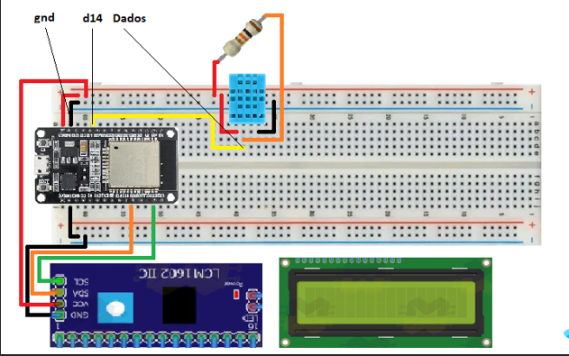

<h1>Termômetro digital</h1>

Projeto desenvolvido com intuito de simular um termômetro digital com as seguintes características.

<li>A cada 30 s uma nova medição deve ser realizada, ou quando um botão especial (LER AGORA) for pressionado. </li>
<li>Cada coleta de temperatura deverá ser apresentada em um display LCD e após 10 s o display deve apagar. </li>
<li>A resolução da apresentação das medições deve ser de 0,1°C.</li>
<li>Na última linha do display LCD deverá conter o histórico das últimas 3 medições em ordem cronológica, separadas por 2 espaços vazios.</li> 
<li>A cada nova coleta, o dado mais antigo é excluído do display.</li>
<li>Deverá haver um botão de reset geral que limpa qualquer dado de temperatura guardado na memória do microcontrolador.</li>

<h2> Componentes utilizados </h2>
<li>1x - Display 16x2</li>
<li>1x - Módulo adaptador I2C</li>
<li>1x - ESP32 ou NodeMCU ESP32S</li>
<li>1x - Sensor DHT11</li>
<li>3x - Resistores de 10k ohms</li>
<li>2x - Push bottons</li>
<li>1x - Breadboard de 830 furos</li>
<li>12x - JUMPERS </li>
<li>1x - Fonte para Breadboard </li>

<h2> Diagrama </h2>

